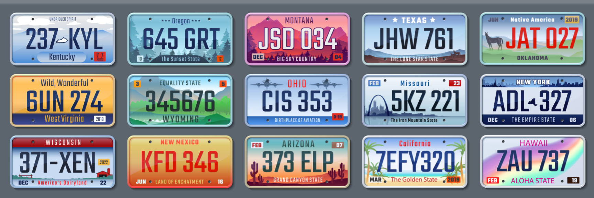
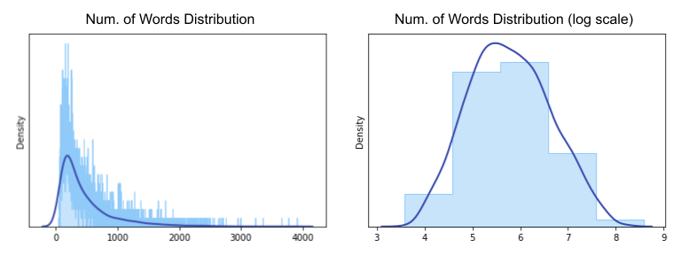
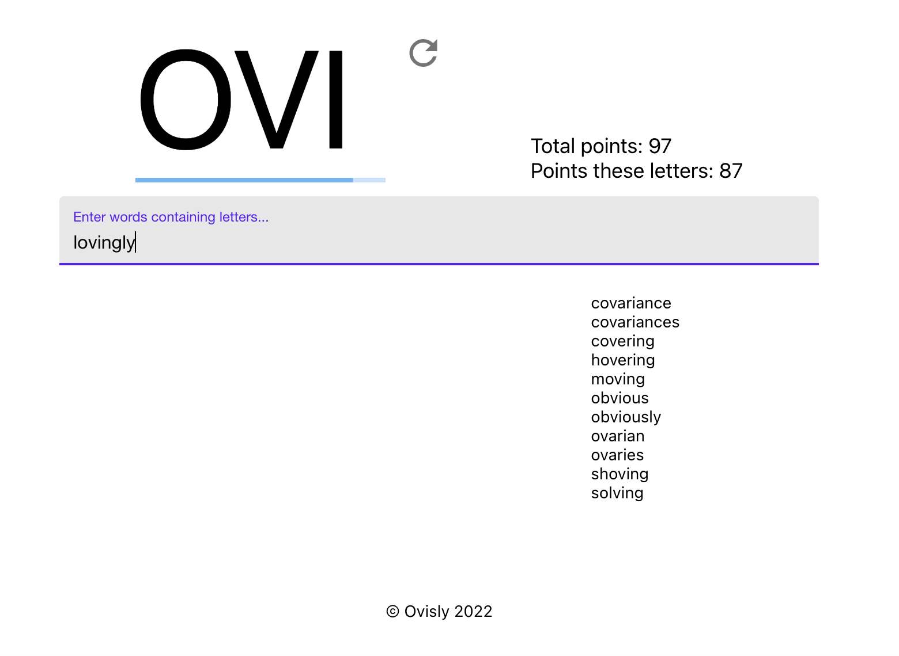

# WRD-PLT (Word Plate)



WRD-PLT (Word Plate) is a roadtrip word game! The game is simple: as another
car drives by, take the three letters on their license plate, and come up with
words containing all three letters in that order.

But not all three-letter triplets are fun for this game. Some are impossible
("ZQX"). Some are too easy ("ING").

To find the perfect zone of playability, we can use statistical analysis.

## All Three-Letter Triplets

There are 26 x 26 x 26 = 17,576 possible three-letter triplets. For simplicity,
we will ignore the fact that not all letters are used in license plates, such as
I and O (more information [here](https://en.wikipedia.org/wiki/United_States_license_plate_designs_and_serial_formats)).

For each of the 17,576 three-letter triplets, we check against the list of
English words to see how many possible answers each triplet has. This is done in
`./analysis/survey.py`.

## Word Frequency as a Difficulty Metric

Not every valid word is equally easy to recall. Typically, the more commonly
used a word is, the easier it is to come up with it in a pinch.

So for all three-letter triplets, and all the words that contain them, we can
calculate their Zipf frequency as a difficulty metric. For example:

```python
>>> dict_results["zzz"]
[('pizzazz', 2.28),
 ('zzz', 2.21),
 ('zazzle', 2.04),
 ('pizazz', 1.85),
 ('razzmatazz', 1.84),
 ('zzzz', 1.8),
 ('zzzzz', 1.49),
 ('bzzz', 1.45),
 ('zzzzzz', 1.37),
 ('zzyzx', 1.36),
 ('zizzi', 1.34),
 ('zzzzzzz', 1.29),
 ('zazz', 1.25),
 ('zizzo', 1.25),
 ('pizzaz', 1.24),
 ('buzzz', 1.22),
 ('zyzz', 1.22),
 ('plzzz', 1.13),
 ('zaporizhzhya', 1.13),
 ('zzzs', 1.13),
 ('bzzzz', 1.11),
 ('zzzzzzzz', 1.1),
 ('razzamatazz', 1.05),
 ('zzzquil', 1.04),
 ('azzouz', 1.02)]
```

The analysis provides us with a way to define a playability range. We can then
select only letter triplets that fall within that range, so that the game is
enjoyable yet challenging.



## How to Play

We have set up the game as a web app at [https://wrd-plt.ovisly.com/](https://wrd-plt.ovisly.com/).
Try it out and see how many points you can get!



More detailed description on the analysis can be found in [my blog](https://blog.ovisly.com/wrd-plt).
